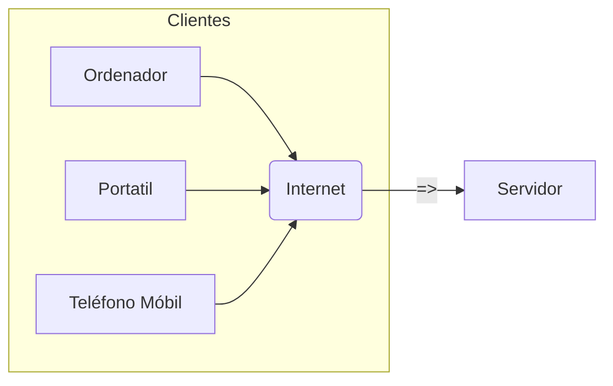

## 1. Mundo web
Pódese pensar no mundo web como **clientes** que consumen contidos fornecidos por  **servidores web**. Na esquina do cliente está o usuario e as ferramentas empregadas, por  exemplo, o navegador web. No lado do servidor hai servidores web (por exemplo, Apache, Nginx, Cherokee, Internet Information Services, ...) aloxados en empresas de hospedaxe .

